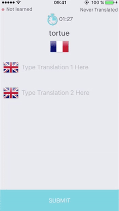

## Summary

### Purpose

Memz is a foreign **language learning assistant** allowing to create your **own dictionary** and be asked periodically to answer **ludic quizes** based on your content. 

The particularity of Memz is its **custom** dictionary populated by the user throughout the days, not only with **words** but also with **expressions**, always a tricky concept for translation applications and websites to support.

Quick and easy to add a new word or expression while abroad **discussing with people**, while **reading a book** or even for a student **working on his lessons**, Memz will help you to learn your content by notifying you via Push Notification every day. 

With **various languages supported**, Memz will even be perfectly suited to users willing to **learn several new languages at a time**, and follow their **progress** consulting their **statistics**.

### Deployment Targets

Memz uses one unique target `Memz` for **iOS**.

## Set-up and Configuration

### Toolset

The project has been developed in **Objectve-c** using **Xcode 7.3.x**.
No other specific tool has beed needed for the front-end implementation of Memz.

### Build Schemes and Configurations

**Two configurations** point to our **two environments**, plus one separate development environement. Those configurations allow to setup different testing environments, gradually from the most up-to-date but unstable one, to the most outdated but stable one. This allows to keep the live environment untouched while development / QA phase. 

All of those configurations are defined in the `Configuration.m` file:

1. **Debug** configuration is signed using the Developer Certificate. This scheme is for developers to run the app while developing.
  * `Segment Token` - `Y24rfqCbuUWtuP5uQnhbGr8foM9Rsipe`
2. **Snapshot** is used to create builds for daily distributions, QA them, etc. 
  * `Segment Token` - `Y24rfqCbuUWtuP5uQnhbGr8foM9Rsipe`
3. **Production** is signed using Distribution Certificate.
  * `Segment Token` - `EMCAdThjAGa6mYPiewkPzfvTAcErlgpT`
  
## Dependency Management 
 
### Setting up the project

Memz relies on **CocoaPods** to manage dependencies. 

There is no need to update the **pods** after cloning the repository as they are already included in the workspace.

### Adding additional carthage dependencies

Like for every project, you can add your own dependencies in the `Podfile` using your favorite text editor, and run `pod update`. You can expect a number of updates to break the project, which might need to be updated accordingly.
   
## Project Architecture

### User Interaction Flow

The application is devided in **several user flows** described in details below. 

The main interaction flow is composed by **three horizontally scrollage views**. Highlighted by a page indicator, they will redirect the user towards **secondary flows** upon interaction. 

The navigation bar will be visible at all times while on the main flow, allowing a **quick interaction** to **add a Word** (navigation bar right button) or **access the Settings** (left). This whichever the current scrollable view is. 

##### User Entrance
This is the **entrance point** of the application. Presented as a paginated scroll view, several steps will guide the user through the **main concepts of the application**.

Note that for now **no authentication is required**. Indeed, the application does not communicate with a server yet. This flow is displayed only once.

##### Feed
This is the **first screen** seen after User Entrance, and when the application is opened / brought back to foreground (except notifications deep linking). This is the **first out of three** scrollable views in the general navigation.

Provides **various articles** giving tips on **how to learn** a language, **cultural facts**, internaltional information related to **moving to other countries**, ect. Another kind of article provides **word and expression suggestions** for a **given domain**, for instance "in the kitchen", "sports", etc. 

Relatively simple, this flow is devided in two screens: list of articles and article details.

##### My Quizzes
Represented by the **second scrollable screen** in the general navigation, this flow will allow to see at a glance your **past** / **pending quizzes** as well as **create a spontaneous new quiz**.  

The application will also **deep link** to the "Answer a quiz" view when a Push Notification is received.

##### My Dictionary
**Third** and **last scrollable screen**, this flow will display you all the words and expressions you have entered in the application. Sorted by "learning index" from the most learned to the least ones. 

Any of the words in the list is tappable and will display its details: **translations** and **statistics** notably.

##### Add Word
Accessible at all times from the general navigation tapping the right navigation bar button, this flow needs to be accessible **very prompty** because will be used by the user "in action" after he just learned a word or expression.

Allows to **type in the new word learned** and all its **known translations**. A **suggestion of translation** is fetched from the server. If the word as already been added, it will also be suggested and the view auto-populated accordingly: will **edit the existing word**.

##### Settings
Also always accessible from general navigation, will naturally allow to **control the settings** of the application: learned and known languages, frequency of quizzes, etc.  

##### Statistics
Separate flow reachable from the Settings screen that will present to the user useful statistics about **their performances by language**, **by word**, as well as tell them how good they have been at **answering quizzes**.

### Application Architecture

The project structure is as follow (Every new file should be created using that structure). The physical file structure should also completely match the xcode groups.
<> denotes groups, and [] denotes files (And <[]> both). Text not surrounded by characters are names (Of groups or files) that shouldn't be changed.

    - Code
	  - [Project Files (App Delegate, Constants, Configuration)]
	  - Controllers
	    - <Flow Number-Flow Name>
	      - <Class Name>
	        - [View Controller Header]
	        - [View Controller Implementation]
	    - ...
	  - Views  
	    - <Flow Number-Flow Name>
	      - <Class Name>
	        - [View Header]
	        - [View Implementation]
	    - ...
	  - Helpers
	    - <Categories> 
	   	  - <Original Class Name>
	        - [Catefory file]
	        - ...
	      - ...
	    - <Classes>
	      - <Class Name>
	         - [Class Files]
			 - ...
		  - ...
		- <Headers>
		  - <Header File Name>
		    - [Header File]
		  - ...
      - Model
        - [MZDataManager]
          - [Data Manager Files]
          - ...
        - <Core Data>
          - [Core Data File]
          - ...
        - <Transformers>
          - <Transformer Class Name>
            - [Transformer File]
          - ...
      - API
        - <Server Source>
          - [Server Integration Implementation File]
          - ...
        - ...
      - Resources (Images.xcassets, Fonts, Localizable files
        - Storyboard 
          - [Flow Number-Flow Name]
		  - ...
		  
Note that the same pattern is followed for the **MemzTests** and **MemzUITests** targets.

### Persistent Storage

*TBD*

### Remote Services

Treblemaker communicates with a **Restful API** whose documentation is available separately, and address is provided above in the Configurations part.

The project implements all API calls following a **decentralized architecture**. Extensions are created on each entity object and implement all calls regarding this entity. For instance, User+API implements all calls regarding User object (register, sign in, update profile, etc.).

The carthage framework **Alamofire** is used to make this API Integration easier. See also the file `TreblemakerServices` that implement a whole list of hightly convenient and reusable methods to request the API.

The link to the back-end documentation is visible [here](http://fueled.github.io/treblemaker-web/).

## Resources and Frameworks

### Bundled Resources

All the sounds that the application can play upon receiving Push Notifications are stored in the bundle. You will find them in the repertory `Resources/Sounds`.

### Third-Party Libraries and Frameworks

Ela relies on both [`carthage`](https://github.com/Carthage/Carthage "Carthage Homepage") and  [`cocoapods`](https://cocoapods.org "Cocoapods Homepage") for Library dependency management. Here is their exhaustive list of libraries this project uses: 

1. [**ReactiveCocoa**](https://github.com/ReactiveCocoa/ReactiveCocoa) (carthage) -  Functional Reactive Programming framework.
2. [**DataSource**](https://github.com/Vadim-Yelagin/DataSource) (carthage) - MVVM-oriented table/collection view handling. 
3. [**Alamofire**](https://github.com/Alamofire/Alamofire) (carthage) - HTTP networking library.
4. [**JSONParsing**](https://github.com/Vadim-Yelagin/JSONParsing) (carthage) - JSON data handling.
5. **Ethanol** - developed and managed by **Fueled**. Ethanol is used in many places throughout the project for utility functions and reusable code.
6. [**HockeySDK**](https://github.com/bitstadium/HockeySDK-iOS) (cocoapods) - HockeyApp Distribution and Crash logs.