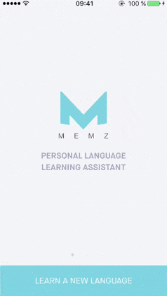

Memz is a foreign **language learning assistant** allowing to create your **own dictionary** and be asked periodically to answer **ludic quizes** based on your content. 

The particularity of Memz is its **custom** dictionary populated by the user throughout the days, not only with **words** but also with **expressions**, always a tricky concept for translation applications and websites to support.

Quick and easy to add a new word or expression while abroad **discussing with people**, while **reading a book** or even for a student **working on his lessons**, Memz will help you to learn your content by notifying you via Push Notification every day. 

- [x] Create your own dictionary
- [x] Consult your word / expression translations 
- [x] Learn with daily quizzes

With **various languages supported**, Memz will even be perfectly suited to users willing to **learn several new languages at a time**, and follow their **progress** consulting their **statistics**.

## Table of Contents

* [Set-up and Configuration](#set-up-and-configuration)
  * [Deployment Targets](#deployment-targets)
  * [Toolset](#toolset)
  * [Build Schemes and Configurations](#build-schemes-and-configurations)
* [Project Architecture](#project-architecture)
  * [User Interaction Flow](#user-interaction-flow)
  * [Application Architecture](#application-architecture)
  * [Persistent Storage](#persistent-storage)
  * [Remote Services](#remote-services)
  * [Technical Details](#technical-details)
* [Resources and Frameworks](#resources-and-frameworks)
  * [Bundled Resources](#bundled-resources)
  * [Third-Party Libraries and Frameworks](#third-party-libraries-and-frameworks)
* [System Integrations](#system-integrations)
  * [Analytics](#analytics)
  * [Automated Tests](#automated-tests)

## Set-up and Configuration

### Deployment Targets

Memz uses one unique target `Memz` for **iOS**.

### Toolset

The project has been developed in **Objectve-c** using **Xcode 7.3.x**.
No other specific tool has beed needed for the front-end implementation of Memz.

### Build Schemes and Configurations

**Two configurations** point to our **two environments**, plus one separate development environement. Those configurations allow to setup different testing environments, gradually from the most up-to-date but unstable one, to the most outdated but stable one. This allows to keep the live environment untouched while development / QA phase. 

All of those configurations are defined in the `Configuration.m` file:

1. **Debug** configuration is signed using the Developer Certificate. This scheme is for developers to run the app while developing.
  * `Segment Token` - `Y24rfqCbuUWtuP5uQnhbGr8foM9Rsipe`
2. **Snapshot** is used to create builds for daily distributions, QA them, etc. 
  * `Segment Token` - `Y24rfqCbuUWtuP5uQnhbGr8foM9Rsipe`
3. **Production** is signed using Distribution Certificate.
  * `Segment Token` - `EMCAdThjAGa6mYPiewkPzfvTAcErlgpT`
   
## Project Architecture

### User Interaction Flow

The application is devided in **several user flows** described in details below. 

The main interaction flow is composed by **three horizontally scrollage views**. Highlighted by a page indicator, they will redirect the user towards **secondary flows** upon interaction. 

The navigation bar will be visible at all times while on the main flow, allowing a **quick interaction** to **add a Word** (navigation bar right button) or **access the Settings** (left). This whichever the current scrollable view is. 

##### User Entrance
This is the **entrance point** of the application. Presented as a paginated scroll view, several steps will guide the user through the **main concepts of the application**.

Note that for now **no authentication is required**. Indeed, the application does not communicate with a server yet. This flow is displayed only once.

##### Feed
This is the **first screen** seen after User Entrance, and when the application is opened / brought back to foreground (except notifications deep linking). This is the **first out of three** scrollable views in the general navigation.

Provides **various articles** giving tips on **how to learn** a language, **cultural facts**, internaltional information related to **moving to other countries**, ect. Another kind of article provides **word and expression suggestions** for a **given domain**, for instance "in the kitchen", "sports", etc. 

Relatively simple, this flow is devided in two screens: list of articles and article details.

##### My Quizzes
Represented by the **second scrollable screen** in the general navigation, this flow will allow to see at a glance your **past** / **pending quizzes** as well as **create a spontaneous new quiz**.  

The application will also **deep link** to the "Answer a quiz" view when a Push Notification is received.

##### My Dictionary
**Third** and **last scrollable screen**, this flow will display you all the words and expressions you have entered in the application. Sorted by "learning index" from the most learned to the least ones. 

Any of the words in the list is tappable and will display its details: **translations** and **statistics** notably.

##### Add Word
Accessible at all times from the general navigation tapping the right navigation bar button, this flow needs to be accessible **very prompty** because will be used by the user "in action" after he just learned a word or expression.

Allows to **type in the new word learned** and all its **known translations**. A **suggestion of translation** is fetched from the server. If the word as already been added, it will also be suggested and the view auto-populated accordingly: will **edit the existing word**.

##### Settings
Also always accessible from general navigation, will naturally allow to **control the settings** of the application: learned and known languages, frequency of quizzes, etc.  

##### Statistics
Separate flow reachable from the Settings screen that will present to the user useful statistics about **their performances by language**, **by word**, as well as tell them how good they have been at **answering quizzes**.

#### Learning Experience

The **learning experience** is a major aspect of the application. Depending on the user settings, **Push Notifications** will be sent several times a day inviting him to answer a Quiz of up to **3 questions**.

Each question will require the user to translate one word he has entered in his dictionary (or added from article suggestions). A **learning index** will allow to keep track of the progress. Every time a word is **correctly translated**, this index will be **incremented**. Every time the word will be **wrongly translated**, **decremented**. 

WHen the user reaches the **learning index** of **5**, the word will be considered as **learned** and will not be asked in the quizzes anymore.

### Application Architecture

The project structure is as follow (Every new file should be created using that structure). The physical file structure should also completely match the xcode groups.
<> denotes groups, and [] denotes files (And <[]> both). Text not surrounded by characters are names (Of groups or files) that shouldn't be changed.

    - Code
	  - [Project Files (App Delegate, Constants, Configuration)]
	  - Controllers
	    - <Flow Number-Flow Name>
	      - <Class Name>
	        - [View Controller Header]
	        - [View Controller Implementation]
	    - ...
	  - Views  
	    - <Flow Number-Flow Name>
	      - <Class Name>
	        - [View Header]
	        - [View Implementation]
	    - ...
	  - Helpers
	    - <Categories> 
	   	  - <Original Class Name>
	        - [Catefory file]
	        - ...
	      - ...
	    - <Classes>
	      - <Class Name>
	         - [Class Files]
			 - ...
		  - ...
		- <Headers>
		  - <Header File Name>
		    - [Header File]
		  - ...
      - Model
        - [MZDataManager]
          - [Data Manager Files]
          - ...
        - <Core Data>
          - [Core Data File]
          - ...
        - <Transformers>
          - <Transformer Class Name>
            - [Transformer File]
          - ...
      - API
        - <Server Source>
          - [Server Integration Implementation File]
          - ...
        - ...
      - Resources (Images.xcassets, Fonts, Localizable files
        - Storyboard 
          - [Flow Number-Flow Name]
		  - ...
		  
Note that the same pattern is followed for the **MemzTests** and **MemzUITests** targets.

### Persistent Storage

Memz uses **Core Data** to store all data generated by the user. This notably allows to seamlessly populate the view controllers using `NSFetchedResultsController`, provide the application with an **offline mode** (will be useful when the application will rely on a remote service, to populate view controllers even if offline as long as data has been fetched at least once before) and allow for better filtering and testing of the data received.

// NEED SHCEMA AND DESCRIPTION

### Remote Services

#### Microsoft Translator API

In order to provide with **suggested translations** as the user types a new word or sentense, Memz hits the Microsoft Bing Translator API.

The file `MZBingTranslatorCoordinator` encapsulates **submission** of requests and handling of the **response**, exposing a very handy and easy to use interface. All languages supported by the application are also supported by this API.

We can note the file `MZBingTranslatorToken` handling expiration of the tokens and `MZBingTranslationWrapper` wrapping each request separately (notably each completion handler) needed given the numerous requests sent successively, sometimes without waiting for the previous response to be received, as the user is writing (one request every time the text changes).

#### Memz Back-End

Memz does not communicate yet with a **Restful API**. It will, in the long run, sync the data entered by the user and allow him to recover it from every device. Articles will also benefit from the back-end, allowing to release / remove them freely over time. An authentication system will be required at that point. The server address will be provided above in the Configurations part, as well as in the file `Constants.h`.

The carthage framework **Alamofire** is used to make this API Integration easier. See also the file `TreblemakerServices` that implement a whole list of hightly convenient and reusable methods to request the API.

### Technical Details

#### Reusable Classes

A large number of **reusable controls** and **classes** have been implemented in order to leverage the impact of code and requirement changes. Some of the most noticeable are described below. A special effort has been put in their **encapsulation** and the **clarity** and **straight-forward nature** of their **header file**. Note that **units tests** have been implemented in order to watch potential **regressions**.

* **MZSwitch**

The native Apple **switch** shows some **limitations** such as inability to set a background off color to replace the native grey one. This subclass allows a lot of **customizations** such as **background colors and pictures** for any state with the possibility of changing them at any time.

* **MZPageControl**

Re-implemented from scratch and **fully customizable**, this page control allows to do in just a few lines what would take hundreds if subclassing the native page control (not to mention the dirty overrides usually implied). 

Specify notably your **custom active/inactive dot images** (with possibly most-left and most-right ones different) and **space between them (animatable)** - and retrieve the whole same API as the native page control one.

* **MZGraphicView**

Based on the native graphic view seen in Health app, a **fully custom** and **dynamic graphic view** has been implemented in Memz.

Based on an array of **numeric values**, the graphic will automatically render depending on two main options for its `yOriginType` variable (calculates y origin value for optimal display based on the set of values, or take value 0).

A lot of properties will be specified, such as background **gradient start and end colors**, **title** and **metrics titles**, show **average line**, etc.

* **MZFlightPickerView**

Used in the Settings flow in order to select the language, this **expendable table view** will provide with a **quick and visible way** to select a value in a **drop-down** like list. 

Takes an array of images in entry, a future improvement could allow for more various types in data source.

* **MZAnimatedArrow**

Although presenting a very **straight-forward API** to the rest of the world, this class implements a complex and mask based **core graphics** representation of **arrows**, **moving throughout the time**. This is especally usefull for the **tutorial views** in order to catch the attention of the user to the most relevant areas of the screen.

* **MZWordDescriptionHeaderView**

Reused in multiple flows (Dictionary and Quiz), this **header** view will be mostly used as table header view. It notably shows a **handful of useful characteristics** for a **given word** (that its light API takes in entry).

#### Reusable Classes

* **MZWordDescriptionHeaderView**

// TODO

## Resources and Dependency Management

### Bundled Resources

#### Feed Articles

Given the Memz back-end not in place yet, **feed articles** have to be embedded in the **application bundle**. A JSON file `feed.json` contains all the articles and their meta-data that needs to be handled by the application.

#### Terms & COnditions and Privacy Policy

The web pages providing **Terms & Conditions** and **Privacy Policy** not being hosted yet, they have been embedded in the application with the names: `Settings-Terms-And-Conditions.htm` and `Settings-Privacy-Policy.htm`. 

### Third-Party Libraries and Frameworks

Memz relies on [`cocoapods`](https://cocoapods.org "Cocoapods Homepage") for Library dependency management. Here is their exhaustive list of libraries this project uses: 

1. [**SDWebImage**](https://github.com/rs/SDWebImage) - Remote images loading and caching.
2. [**DATAStack**](https://github.com/3lvis/DATASource) - Core Data basic handling encapsulation.
3. [**NMRangeSlider**](https://github.com/muZZkat/NMRangeSlider) - Double dotted Range Slider. 
4. [**Analytics**](https://github.com/segmentio/analytics-ios) - Segment Analytics. 

## System Integrations

### Analytics

**Segment** has been chosen to handle Analytics, notably for the number of other relevant Analytics it gathers and its flexability. From the large choice **Mixpanel** has been integrated in Memz.

#### Events tracked

Three main **events** are being tracked with various attached properties:

- [x] Word Addition (number translations)
- [x] New Quiz (is initiated by user, known language, new language)
- [x] Article Suggestion Word Addition (addition all suggested words at once)

#### Screens tracked

Some **screens** are tracked in order to know **how long** and with which **frequence** each flow has been consulted by our users.

- [x] User Entrance Screen
- [x] Word Addition Screen
- [x] Settings Screen
- [x] Statistics Screen
- [x] Quiz Screen
- [x] Article Screen

### Automated Tests

#### Unit Tests

An imporant effort has been dedicated to the **unit tests**. Most of the **central classes**, **managers** and **helpers** used throughout the application have particularly been carefully covered.

The general goal is to reach a codebase as **reliable** as possible, to monitor and highlight **regressions** as the project grows and to provide some additional **documentation**.

_Currenty_: 

- [x] 24% Code Coverage
- [x] 151 Unit Tests

#### UI Tests

Will be implemented soon.

## License

Memz is released under the MIT license. See license shield above for details.

